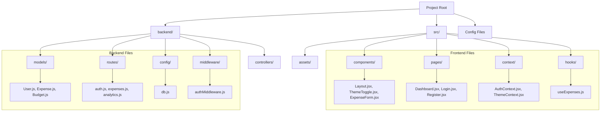

# Smart Budget Planner - Project Structure Documentation

This document provides a comprehensive overview of the file structure for the **Smart Budget Planner** application.

## 📂 Root Directory
| File / Directory | Description |
| :--- | :--- |
| `backend/` | Contains all server-side code (Node.js/Express). |
| `src/` | Contains all client-side code (React). |
| `public/` | Static assets like favicon and manifest files. |
| `index.html` | The HTML entry point where the React app is mounted. |
| `package.json` | Manifest file listing project dependencies (`react`, `express`, `mongoose`, etc.) and scripts. |
| `vite.config.js` | Configuration for Vite (the build tool and dev server). |
| `tailwind.config.js` | Configuration for Tailwind CSS (styling framework). |
| `postcss.config.js` | Configuration for PostCSS (processes Tailwind CSS). |

---

## 📂 Backend (`/backend`)
Handles API requests, database connections, and authentication.

| File / Directory | Description |
| :--- | :--- |
| **`server.js`** | The **entry point**. Initializes the Express app, connects to MongoDB, and defines base routes. |
| **`config/db.js`** | Handles the connection logic to the MongoDB database using Mongoose. |
| **`middleware/authMiddleware.js`** | Middleware to verify JWT tokens and protect private routes (like Dashboard). |
| **`.env`** | *Sensitive*: Stores environment variables like `MONGO_URI` and `JWT_SECRET`. |

### `backend/models`
Database schemas defining the shape of your data.
*   `User.js`: Schema for user accounts (email, password hash, name).
*   `Expense.js`: Schema for individual transactions (amount, category, date, description).
*   `Budget.js`: Schema for monthly budget limits per category.

### `backend/routes`
API endpoints that the frontend calls.
*   `auth.js`: Endpoints for Login (`/login`) and Registration (`/register`).
*   `expenses.js`: CRUD endpoints for adding, fetching, and deleting expenses.
*   `analytics.js`: Endpoints for fetching aggregated data (charts, totals) for the dashboard.
*   `budget.js`: Endpoints for setting and retrieving budget limits.

---

## 📂 Frontend (`/src`)
The React application interface.

| File / Directory | Description |
| :--- | :--- |
| **`main.jsx`** | The **entry point**. Renders the `App` component into `index.html`. |
| **`App.jsx`** | Sets up the Router (`react-router-dom`) and wraps the app in Providers (Auth, Theme). |
| **`index.css`** | Global styles, including Tailwind directives and custom theme overlays. |

### `src/components` (Reusable UI)
*   `Layout.jsx`: The main shell application. Contains the **Sidebar** (desktop) and **Header** (mobile).
*   `ThemeToggle.jsx`: Component to switch between Light and Dark modes.
*   `ExpenseForm.jsx`: The form used in "Log Spending" to add new transactions.
*   `ExpenseList.jsx`: Displays a list of recent transactions.
*   `ExpenseItem.jsx`: Renders a single row/card for an expense in the list.
*   `BudgetProgress.jsx`: Visual progress bar showing much of the budget has been used.

### `src/pages` (Screens)
*   `Dashboard.jsx`: The home screen. Shows "Smart Budget Planner" overview, charts, and recent activity.
*   `Login.jsx`: User login screen.
*   `Register.jsx`: User sign-up screen.
*   `AddTransaction.jsx`: Dedicated page for adding expenses ("Log Spending").
*   `Expenses.jsx`: A full history view of all transactions ("History").
*   `BudgetPlanning.jsx`: Interface for setting monthly limits ("Budget Plan").
*   `Settings.jsx`: User profile and application settings.

### `src/context` (State)
*   `AuthContext.jsx`: Global state for the user. Handles `login()`, `logout()`, and checking if user is authenticated.
*   `ThemeContext.jsx`: Global state for the theme. Persistence to `localStorage` (Light/Dark).

### `src/hooks` (Logic)
*   `useExpenses.js`: Custom React hook that abstracts API calls to fetch expenses and budgets using the Auth token.
